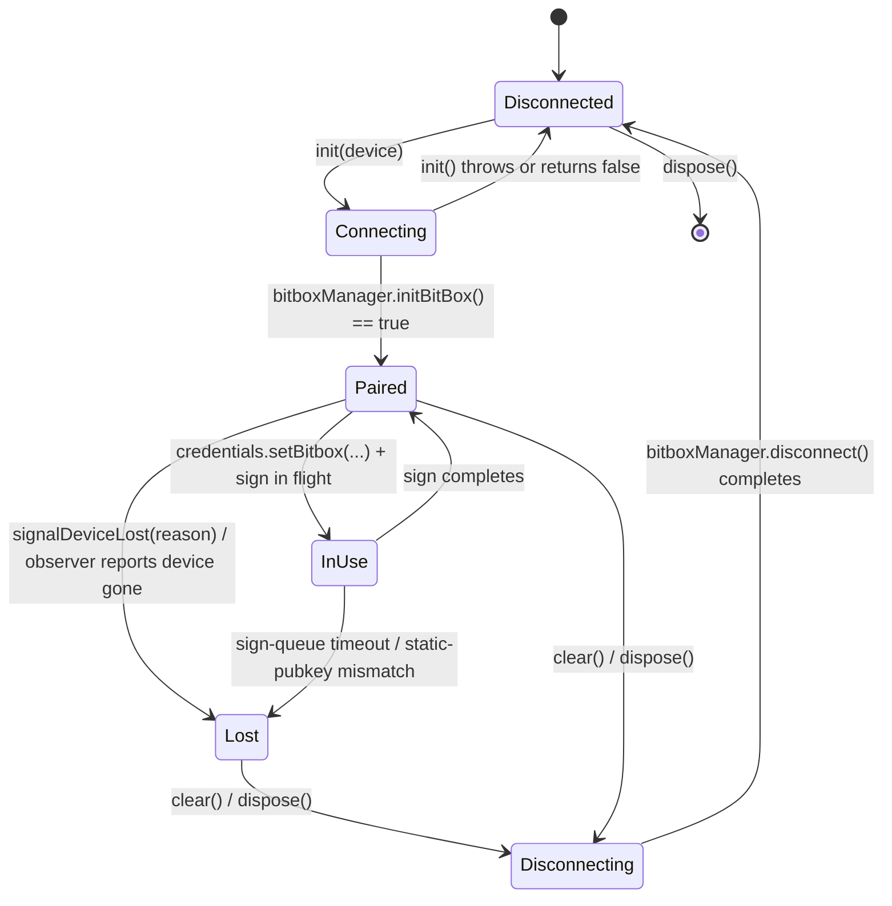

# ADR 0001 — BitBox Connection Lifecycle

Status: Proposed
Date: 2026-05-23
Initiative: I — BitBox Connection Lifecycle
Reviewers: @TaprootFreak (mandatory)

## Context

Three concurrent sources of truth currently model the BitBox connection state:

1. `BitboxService._isConnected` — a private boolean, written from `init()` and the
   periodic observer.
2. `BitboxCredentials.isConnected` — derived from a nullable `bitboxManager` per
   address, mutated by `setBitbox`/`clearBitbox` from both the service and the
   sign-queue timeout.
3. `ConnectBitboxCubit.state` — emitted from the connect-bitbox cubit, which
   makes its own decisions based on what `BitboxService` reports.

The three drift on every important event:

- F-032 — `init()` sets `_isConnected = true` BEFORE the credentials fan-out
  completes; a sign racing through `getCredentials()` on another isolate can
  observe "connected" while the credentials are still detached.
- F-009 — `_synchronizeBoundedSign` on timeout calls `clearBitbox()` on the
  credentials and frees the queue slot, but never tells `BitboxService` that
  the device is gone. The observer keeps thinking we are connected; the next
  reconnect must come from the user manually unplugging.
- F-045 — `_connectionStatusObserver` only inspects the `devices.isEmpty` branch
  and ignores any non-empty list. A user who unplugs their BitBox and plugs in a
  different one is reported "still connected".
- F-005 / F-024 — `_credentialsByAddress` is never cleared on wallet-delete;
  `_onDeleteCurrentWallet` only stops the observer. A subsequent "restore from
  different seed → pair same physical device at a different account index"
  silently re-attaches the OLD derivation path.
- F-007 — `init()` is not serialised against concurrent invocation; two
  rapid-fire `connectToBitbox` calls can race two `bitboxManager.connect()` calls
  on the same manager, with undefined behaviour for the noise channel.
- F-033 / F-034 — no `dispose()` on the singleton; hot-restart leaves the
  prior `BitboxManager` claimed natively.

The worst case is: user deletes wallet A, factory-resets the BitBox, restores
wallet B from a different seed. Stale credentials bind wallet B's derivation
path to the device's new static pubkey without prompting re-pair; the observer
reports "still connected"; the next sign flows to a device the user no longer
owns.

## Decision

Adopt a single source of truth for the BitBox connection state, owned by
`BitboxService`. Every other consumer — `BitboxCredentials`,
`ConnectBitboxCubit`, `HomeBloc`, `WalletService`, future cubits — subscribes
to a broadcast stream of typed state transitions and holds no parallel
connected-flag of its own.

### State machine



`Lost` is a terminal sub-state for the current pairing session — the consumer
must call `clear()` to transition to `Disconnecting` and then `Disconnected`
before another `init()` can succeed.

### Stream contract

`BitboxConnectionStatus` is a Dart sealed class hierarchy:

```dart
sealed class BitboxConnectionStatus {}
final class Disconnected extends BitboxConnectionStatus {}
final class Connecting extends BitboxConnectionStatus { final BitboxDevice device; }
final class Paired extends BitboxConnectionStatus { final BitboxDevice device; }
final class InUse extends BitboxConnectionStatus { final BitboxDevice device; final SignContext context; }
final class Lost extends BitboxConnectionStatus { final LostReason reason; }
final class Disconnecting extends BitboxConnectionStatus {}

enum LostReason {
  signQueueTimeout,
  staticPubkeyMismatch,
  manualDisconnect,
  deviceUnreachable,
  factoryResetDetected,
}
```

All variants are immutable. Equality is value-based (Equatable). The stream is
broadcast and replay-last-value — late subscribers receive the current state
synchronously on subscription.

### Ownership rules

- `BitboxService` is the **sole writer** to the stream.
- `BitboxCredentials` does NOT mutate `BitboxService` state directly. When
  `_synchronizeBoundedSign` hits a timeout it calls
  `_bitboxService.signalDeviceLost(LostReason.signQueueTimeout)` and lets the
  service decide the transition.
- `ConnectBitboxCubit` does NOT keep its own `isConnected` field. Its state is
  derived from the stream + its own UX-only states
  (`BitboxCheckHash`, `BitboxCapturingSignature`, etc.). The pairing flow is
  still cubit-driven; the new contract is that whenever the cubit needs to
  know "are we still connected?", it asks `BitboxService.currentStatus`.
- `HomeBloc._onDeleteCurrentWallet` calls `BitboxService.clear()` — which
  empties the credentials map, tears down the observer, disconnects, and
  emits `Disconnected` — in addition to the existing
  `stopConnectionStatusObserver` (kept for backward compatibility; `clear()`
  invokes it internally).
- `WalletService` does not subscribe — it consumes `BitboxService` only
  through explicit method calls. The lifecycle hook is the `clear()` call
  on wallet delete (mediated by `HomeBloc`).
- Stream subscriptions in cubits are mandatory-cancelled in `close()`.

### Init concurrency guard

`init()` is guarded by a `Future<BitboxConnectionStatus>? _pendingInit`.
Concurrent callers `await` the same future. Result:

- One physical `bitboxManager.connect(device)` per concurrent batch.
- Property-test pinned: for any N concurrent `init()` calls, exactly one
  `connect()` invocation.

### Lifecycle methods

- `Future<BitboxConnectionStatus> init(BitboxDevice)` — guarded; emits
  `Connecting(device)` then `Paired(device)` on success, `Disconnected` on
  failure.
- `Future<void> clear()` — disconnects, cancels observer, empties
  `_credentialsByAddress`, emits `Disconnecting → Disconnected`. Idempotent.
- `void signalDeviceLost(LostReason)` — only valid from `Paired` / `InUse`;
  emits `Lost(reason)`, tears down observer, clears each credentials' manager.
  Idempotent — repeated calls from the same state are no-ops.
- `Future<void> dispose()` — emits final `Disconnected`, closes the stream
  controller. Used for hot-restart and end-of-app. Post-`dispose()` calls to
  `init()` throw `StateError`.

## Alternatives considered

1. **Enum instead of sealed class.** Rejected. The `Paired(device)` and
   `Lost(reason)` variants carry data that consumers need (which physical
   device is paired, why the device was lost). An enum would force a separate
   "current device" field on the service, recreating the parallel-state-of-truth
   problem.

2. **`ValueNotifier<BitboxConnectionStatus>` instead of `Stream`.** Rejected.
   `ValueNotifier` is a Flutter framework type and would couple `BitboxService`
   (a service-layer construct, tested without `flutter_test`) to widget tree
   lifecycles. A `Stream` carries no framework dependency, integrates with
   `bloc`'s `emit`/`listen` patterns, and supports backpressure semantics if
   we ever need them.

3. **Plain `StreamController<BitboxConnectionStatus>.broadcast()` without
   replay.** Rejected. Late subscribers (e.g. a fresh `ConnectBitboxCubit` after
   the service has already paired) would not see the current state until the
   next transition. The Stream-with-replay-last-value pattern (hand-rolled
   inside `BitboxService` via a `_lastStatus` field exposed as `currentStatus`
   + an immediate replay in the stream getter) preserves the "subscribe and
   know" property without dragging in `rxdart`'s `BehaviorSubject`. `rxdart`
   is not in `pubspec.yaml` today; adding it just for one type would violate
   Mandate §1 Law 15.

4. **Per-credentials connection state instead of service-level.** Rejected.
   The audit (F-005, F-024) shows that any per-instance flag desyncs from
   the physical-device truth and from sibling credentials sharing the same
   noise cipher. Single SoT at the service is the only invariant that
   survives the multi-credential-fan-out lifecycle.

5. **No replay at all; consumers cache the latest state themselves.**
   Rejected — it reintroduces the parallel-state-of-truth problem this ADR
   exists to solve.

## Consequences

### Positive

- Single source of truth for connect-state — F-005, F-007, F-009, F-024,
  F-032, F-033, F-034, F-045 close as one architectural unit.
- Property-pinnable invariant: any sequence of `init`/`clear`/`signalDeviceLost`
  emits a valid state-machine traversal.
- Sign-queue timeout no longer silently desyncs the service from the
  credentials.
- `_onDeleteCurrentWallet` cleanup actually clears the credentials map —
  closes the "delete wallet, restore different seed, sign against wrong
  derivation path" worst-case in the Context section.
- Stream model integrates cleanly with the `bloc` package and with future
  Initiative III FakeBitboxCredentials inject-points
  (`injectDisconnectAtPage`, etc.).
- `dispose()` makes hot-restart and tests deterministic.

### Negative

- The pre-existing `bool isConnected` on `BitboxCredentials` becomes a derived
  view, not a writeable flag. Tests that asserted on it still work but should
  be migrated to assert on `service.currentStatus` for clarity. Migration in
  Initiative I commits.
- Every consuming cubit gains a stream subscription that must be cancelled
  in `close()`. Lint-enforceable if we add the lint; in the interim, the
  cubit close path is asserted by unit test.

### Neutral

- The pre-existing `startConnectionStatusObserver()` / `stopConnectionStatusObserver()`
  callers (`ConnectBitboxCubit`, `HomeBloc`) keep their direct API for now;
  the observer is an internal driver of the stream rather than a parallel
  signal. A follow-up ADR may collapse those callers into pure stream
  subscribers.

## References

- Backlog items: BL-014, BL-015, BL-016, BL-019, BL-040, BL-041, BL-042,
  BL-044, BL-078, BL-079.
- Audit findings (`audit-bitbox-2026-05-23/realunit-app-bitbox-findings.md`):
  F-005, F-007, F-009, F-024, F-032, F-033, F-034, F-045.
- TF cluster: Cluster B (Channel-Hash Race / Re-Pair Stale Hash) in
  `audit-bitbox-2026-05-23/taprootfreak-crawl.md`.
- TF tracking: realunit-app#468 (BitBox lifecycle 17-item tracking).
- Initiative III co-design (BL-008) — factory-reset / device-replaced
  scenarios will land Tier-2 verifiers for `LostReason.staticPubkeyMismatch`
  and `LostReason.factoryResetDetected`.
