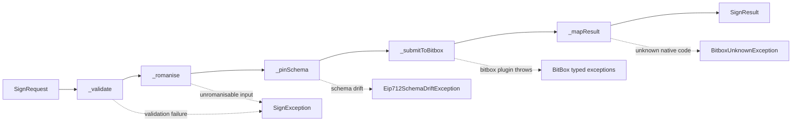

# ADR 0002 — Sign Pipeline Architecture

- **Status:** Proposed (Initiative II)
- **Date:** 2026-05-23
- **Initiative:** II — Sign Pipeline Defense-in-Depth
- **Related findings:** F-002, F-003, F-018, F-019, F-020, F-021, F-030, F-031, F-038, F-039, F-040, F-041, F-042
- **Related backlog:** BL-002, BL-005, BL-006, BL-020/021, BL-025, BL-027..BL-031, BL-035, BL-068..BL-070, BL-073

## Context

The current sign surface is a `static` helper (`Eip712Signer.signRegistration` /
`signDelegation`) called directly from six different code paths — the KYC
`completeRegistration`, the merge-confirm `registerWallet`, the EIP-7702 sell
`confirmPayment`, the EIP-7702 sell `signAuthorization`, the `DFXAuthService`
auth-message sign, and (future) the BTC PSBT sell path. Each callsite owns its
own romanisation, its own validation, its own type-byte handling, and its own
error translation.

Concrete consequences observed in the 2026-05-23 audit:

- **F-038** — `signDelegation` builds the EIP-712 types map from
  backend-supplied `Eip7702Types`. A malicious / MITM-ed backend can inject a
  hidden field; the user signs a delegation they cannot see in the
  validation UI.
- **F-041** — `signRegistration`'s EIP-712 domain has no `chainId`. Same
  signature replays across chains and backends.
- **F-040** — `BitboxCredentials.signToSignature` strips `payload[0]` for
  EIP-1559 without asserting it actually is the `0x02` type byte. A caller
  that mislabels a legacy payload silently corrupts the signed bytes.
- **F-019** — Romanisation is applied at the registration callsite but the
  `kycData` sub-object intentionally keeps UTF-8. A future caller can forget
  the romanisation step and break the signed/stored byte-equality contract.
- **F-002** — `swissTaxResidence: true` is hardcoded at the page layer and
  flows verbatim into the signed envelope. There is no form control. The
  contract between "what the user attests" and "what they sign" is broken at
  the very edge.
- **F-042** — `registrationDate` is generated client-side from
  `DateTime.now()`. A jail-broken device clock signs an arbitrary date.
- **F-003 / F-016 / F-020 / F-021** — Cubits do `catch (e) { e.toString() }`
  string-matching to recover the BitBox cause from a generic failure. Any
  type renamed downstream silently drops the special handling.

The worst-case adversary is a compromised DFX backend (or MITM with TLS
intercept) that returns an EIP-7702 schema with an extra `{name:
"secretApproval", type: "uint256"}` field; the user sees the visible amount
in the validation UI, taps sign, and the BitBox signs a schema the user can
never inspect after the fact.

## Decision

Introduce a single sign **pipeline** that owns every step between
`SignRequest` and `SignResult`. The Dart side never reaches the BitBox plugin
outside this pipeline.

```
SignRequest ──► validate ──► romanise ──► pinSchema ──► submitToBitbox ──► mapResult ──► SignResult
                  │              │             │              │                │
                  │              │             │              │                └─ typed `SignException` hierarchy
                  │              │             │              └─ sole callsite of the BitBox plugin
                  │              │             └─ byte-equal compare backend types against schema constant
                  │              └─ `toBitboxSafeAscii` on every user string in envelope AND DTO
                  └─ field-presence + type contracts on the request itself
```



### Concrete commitments

1. **`Eip712Signer` becomes a DI-injected service**, not a static helper. The
   `SoftwareWallet` path remains synchronous, but callsites depend on the
   abstraction and tests substitute a fake.
2. **Schema classes** (`RegistrationSchemaV1`, `KycSignSchema`,
   `Eip7702DelegationSchema`, `BtcPsbtSchema`) are compile-time `const`
   objects. Their `types` map IS the trusted client-side schema. Backend
   responses are compared **byte-equal** against this constant; any
   extra / missing / reordered / wrong-type field raises
   `Eip712SchemaDriftException` BEFORE the plugin sees any byte.
3. **`SignPipeline`** is the single entry. Six variants of
   `sealed class SignRequest` (Registration, Kyc, Sell, Eip7702, BtcPsbt,
   EthTransfer). No alternate "I'll just call the signer directly" path.
4. **Romanisation invariant**: `pipeline(s).envelope == pipeline(s).dto`
   byte-equal for every user string. Tests pin this as a property.
5. **`signDelegation`** takes explicit `expectedVerifyingContract`,
   `expectedChainId`, `expectedDelegator`, `expectedAmount` parameters. The
   signer validates internally and refuses to delegate to "validate over
   there" — encapsulation is back inside the trust boundary.
6. **`chainId` in registration domain** (F-041). Property test pins the
   cross-chain replay safety.
7. **`payload[0] == 0x02` assert before EIP-1559 strip** (F-040). Runtime
   check that throws `Eip1559TypeMismatchException` in release; assert in
   debug as a developer-experience signal.
8. **`registrationDate` from server clock** (F-042). The request carries the
   server-issued timestamp; the client never signs `DateTime.now()`.
9. **`ErrorMapper`** maps native BitBox error codes (101 = invalid input,
   etc.) to typed `SignException` subclasses, with each typed exception
   carrying an i18n ARB key. An exhaustive test fails the build if a code
   has no mapping.
10. **`KycEmailVerificationCubit`** routes `BitboxNotConnectedException`
    to a typed `KycEmailVerificationBitboxRequired` state instead of
    swallowing into a generic `RegistrationFailure`. The sign-gate flip
    moves inside the cubit's success branch (F-018).

## Alternatives considered

1. **Static helper + caller-validates.** Status quo. Rejected because every
   new callsite re-implements romanisation / schema-pinning / error-mapping
   from memory; the audit found six callsites with five different shapes.
2. **Top-level functions in a `sign.dart` library.** Same testability problem
   as the static helper — no DI seam, hard to substitute a fake, every test
   pays for the real eth_sig_util.
3. **Code-gen schemas from a backend OpenAPI / JSON-Schema spec.** Tempting
   because it would close the byte-equality loop automatically. Rejected for
   this initiative because: (a) DFX backend does not publish a JSON-Schema
   today, (b) "the schema is what the backend says it is" is the F-038 bug,
   not the fix. The whole point of pinning is that the client must NOT
   trust whatever the backend currently happens to publish.
4. **Runtime-fetched schemas from a versioned endpoint with separate
   signing key.** Conceptually stronger because it lets the schema evolve
   without app updates. Rejected as out-of-scope for Initiative II — needs a
   coordinated backend deliverable and a separate trust root. The current
   ADR keeps schemas in client source; ADR 0003 (Initiative IV) can revisit.
5. **Single mega-signer class that absorbs `SoftwareWallet` and BitBox
   together.** Rejected because Initiative IV is moving `SoftwareWallet`
   behind an isolate IPC seam. Letting the signer reach into the wallet
   directly would conflict with that refactor.

## Consequences

### Positive

- **One callsite to audit.** Schema-pinning, romanisation, type-byte assert,
  error-mapping all live in one place. A new sign use-case files a new
  `SignRequest` variant and goes through the same `_validate → _romanise →
  _pinSchema → _submitToBitbox → _mapResult` path.
- **`e.toString()` string-matching dies.** Cubits switch on typed
  exceptions; the ARB key is owned by the exception, not by the caller.
- **Property-tested cross-chain safety.** `chainId` differs → signature
  differs is a fuzz-property the CI runs forever.
- **Defence against a malicious backend.** Extra-field attack surfaces as a
  typed exception **before** the BitBox sees any byte.
- **Coverage gate is enforceable.** Pipeline + signer + error-mapper +
  schemas all live in `lib/packages/wallet/`; the existing branch-coverage
  policy can require ≥ 95 % on that directory.

### Negative / risks

- **Schema drift from backend is now a build failure waiting to happen.** If
  the backend ships a v2 schema before the app catches up, registration
  breaks. Mitigation: versioned schemas (`RegistrationSchemaV1`, `V2`); the
  pipeline tries each known version in turn before declaring drift.
- **Coordinated backend change for `chainId`.** Adding `chainId` to the
  domain changes the signed hash. Until backend accepts the new domain, the
  field is sent as non-signed metadata. Tracked in the journal; deadline
  pinned by Initiative II acceptance gate (§6.II).
- **DI cost.** Every callsite now resolves the signer + schema from the
  container instead of calling `Eip712Signer.signRegistration` directly.
  Small ergonomic cost; pays for itself in testability.
- **One more layer to learn.** New contributors have to read
  `sign_pipeline.dart` before adding a sign flow. The ADR exists so the
  read is short.

### Failure modes (and what catches them)

| Failure mode                                      | Caught by                                                |
| ------------------------------------------------- | -------------------------------------------------------- |
| Backend returns extra field in EIP-7702 schema    | `_pinSchema` byte-equal compare → `Eip712SchemaDriftException` |
| Romanisation skipped on a new DTO field           | Property test `pipeline(s).envelope == pipeline(s).dto`  |
| `chainId` change replays on a different chain     | Property test "differing chainId → differing sig"        |
| Native firmware ships a new error code            | `ErrorMapper` exhaustiveness test → build red until mapped |
| Caller assumes `isEIP1559` without `0x02` prefix  | `payload[0] == 0x02` assert → `Eip1559TypeMismatchException` |
| New cubit re-implements `catch (e) { e.toString() }` | `grep` lint in CI; ErrorMapper is the only allowed router |
| `swissTaxResidence` UI binding lost in refactor   | Form validator + property test on envelope value          |
| `registrationDate` regresses to `DateTime.now()`  | Request carries the server-issued timestamp; client-clock fallback removed |

## Implementation order

1. ADR 0002 (this document).
2. Schema base + `RegistrationSchemaV1` + tests pinning byte-equal compare.
3. `KycSignSchema`, `Eip7702DelegationSchema`, `BtcPsbtSchema` + drift-rejection tests.
4. `ErrorMapper` + exhaustive mapping table + i18n keys.
5. `SignPipeline` with six `SignRequest` variants + pipeline-step unit tests.
6. `Eip712Signer` static → DI refactor; preserve backward-compatible static
   wrappers for `RealUnitRegistrationService` / `RealUnitSellPaymentInfoService`
   until both are migrated to the pipeline.
7. EIP-7702 schema pinning with explicit expected params.
8. `chainId` in registration domain (with backend-coordinated rollout).
9. `payload[0] == 0x02` assert in `BitboxCredentials.signToSignature`.
10. Six-entrypoint Tier-1 integration test against `FakeBitboxCredentials`.
11. `swissTaxResidence` form input + country-derived default.
12. `KycEmailVerificationCubit` typed routing + sign-gate move + latch reset.
13. 13-page disconnect-mid-sign Tier-1 integration test.

## Acceptance gate (§6.II)

- ADR 0002 accepted, TF-reviewed.
- `Eip712Signer` injected service; every callsite via DI.
- Six entrypoint Tier-1 test green.
- Romanisation property test green.
- Schema-pinning Tier-0 + (Tier-2 testkit) green.
- ErrorMapper exhaustive test green; zero `e.toString()` string-matching in cubits.
- `swissTaxResidence` form input live; TF #526 closeable.
- `chainId` in domain; cross-chain replay property test green.
- All in-scope backlog items `done` with regression-index entries.
