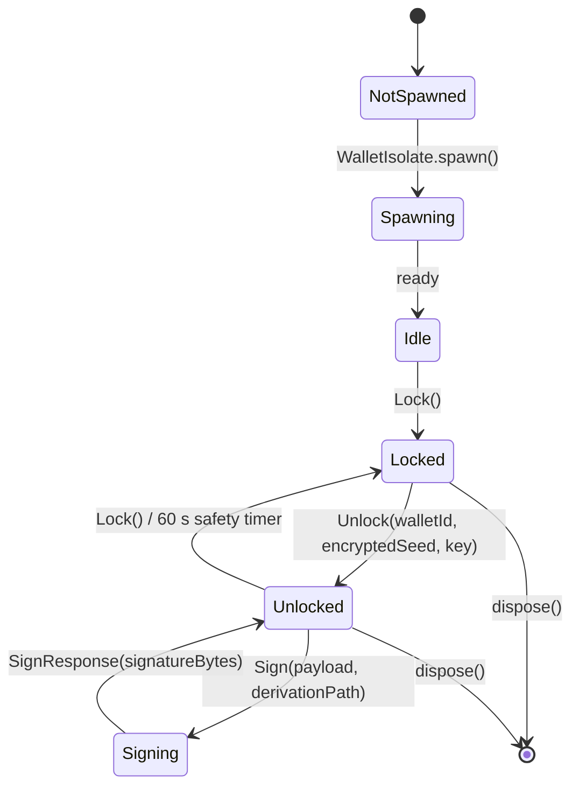

# ADR 0004 — Crypto Hygiene Boundaries

Status: Proposed
Date: 2026-05-23
Initiative: IV — Crypto Hygiene
Reviewers: @TaprootFreak (mandatory)

## Context

The BIP39 mnemonic protecting every user wallet currently lives as a plain
Dart `String` in `SoftwareWallet.seed` for the full foreground lifetime of
the process (F-004). Dart has no zeroization primitive — once a `String`
enters the heap, only GC can release it, and GC has no obligation to clear
the underlying bytes. Adjacent issues compound the exposure:

- F-001 — `WalletStorage.deleteWallet` removes only `walletAccountInfos`,
  never `walletInfos`. Encrypted seed rows accumulate forever, gated only
  by the Keychain-stored mnemonic encryption key.
- F-013 — `WalletService.lockCurrentWallet`'s `inFlight.ignore()` does not
  cancel an in-flight DB decrypt; the freshly-decrypted `SoftwareWallet`
  briefly lives in a local even after the slot is invalidated.
- F-014 — `VerifySeedCubit` has no lifecycle observer; a user who reached
  verify-seed and backgrounds the app leaves the BIP39 phrase in the iOS
  snapshot for the verify-seed window.
- F-025 — PIN derivation runs at 250k iterations; the legacy acceptance set
  still contains `10000`, well below contemporary OWASP-2025 guidance of
  600k for PBKDF2-HMAC-SHA256.
- F-026 — `BiometricService.authenticate` returns a plain `bool` with no
  CryptoObject binding; a patched return-true on a rooted device bypasses
  the gate without unlocking any cryptographic material.
- F-027 — `flutter_secure_storage` is constructed with default
  `IOSAccessibility` / `AndroidOptions`. iCloud Keychain backup-restore to
  a different device could carry the database encryption key with it once
  the upstream default ever flips.
- `bitbox_flutter` F-013 — 36 unconditional `print()` calls in
  `Bluetooth.swift` emit BLE hex + UUIDs to production logs on every
  notification (~once per 50 ms during a multi-page sign), plus
  `fmt.Printf` calls across `go/api/*.go` for device error paths.

### Threat model

```
                                +-------------------+
                                |   BIP39 phrase    |
                                |   (12 / 24 words) |
                                +---------+---------+
                                          |
        +--------- AES-GCM ---------------+--------- PBKDF2 + biometric -+
        |                                                                |
        v                                                                v
+-------+-------+         +---------------+              +---------------+
| SQLCipher DB  |         |  Main heap    |              |  Keychain /   |
| walletInfos   |         |  (Dart String)|              |  Keystore     |
| .seed = AES   |         |  pre Init.IV  |              |  mnemonic-key |
+-------+-------+         +---------------+              +-------+-------+
        |                          ^                             |
        | SQLCipher master key     | Init.IV moves the           | Wraps
        | encrypted via            | mnemonic-byte off this      | the AES-GCM
        | flutter_secure_storage   | heap into a dedicated       | mnemonic key
        v                          | Isolate (own heap)          v
+-------+-------+                  v                     +-------+-------+
| Keychain /    |          +---------------+             | Biometric    |
| Keystore key  |          | Wallet Isolate|             | vault / SEP  |
| (post Init.IV)|          | heap          |             | (post Init.IV)|
+---------------+          | (Init.IV)     |             +---------------+
                           +---------------+
```

**Actors and what they can read:**

| Actor                                 | Pre Init. IV                                  | Post Init. IV                                  |
|---------------------------------------|-----------------------------------------------|------------------------------------------------|
| Foreground process (in-app code)      | Plain mnemonic in `SoftwareWallet.seed`       | Opaque handle; mnemonic lives in Isolate heap  |
| iOS app suspend snapshot              | Mnemonic visible in main-isolate snapshot     | Snapshot of main isolate does not contain seed |
| Jailbreak/root + Frida attach to main | Heap walk yields BIP39 phrase                 | Heap walk yields only address + handle id      |
| Jailbreak/root + Frida attach to Iso. | Same (no isolate boundary)                    | Heap walk yields mnemonic only during sign     |
| Filesystem extraction (post-rest)     | All historical encrypted seeds (F-001)        | Only currently-held wallet rows                |
| iCloud Keychain restore to new device | Default accessibility: future-flip exposure   | `first_unlock_this_device` blocks transfer     |
| Backend / network                     | Never sees the seed                           | Never sees the seed                            |

**Storage encryption stack:**

```
+----------------------------------------------------------+
|  SQLCipher                                               |
|  master key:  Keychain entry "drift.encryption.password" |
|               (post: first_unlock_this_device)           |
|                                                          |
|  Table: walletInfos                                      |
|  Column seed = base64(iv) ":" base64(AES-GCM(plain))     |
|                                                          |
|  AES-GCM key: Keychain entry                             |
|               "wallet.mnemonic.encryption.key"           |
|               (post: first_unlock_this_device)           |
+----------------------------------------------------------+

Trust boundaries:
  - Disk     ↔ SQLCipher master key       (Keychain hardware-backed)
  - Cipher   ↔ mnemonic-encryption-key    (Keychain hardware-backed)
  - Plain    ↔ Main isolate / Wallet isolate process boundary
  - Process  ↔ Biometric vault            (SEP / TEE)
```

## Decision

Move the BIP39 phrase off the main isolate's heap entirely. The main
isolate sees only typed IPC requests and responses; the seed lives in a
dedicated `WalletIsolate` whose heap is not visible to the foreground
process. All adjacent hardening lands together so the heap-probe contract
holds end-to-end.

### Wallet Isolate architecture



**Process boundary.** The Isolate runs in its own Dart heap. The
`SendPort` / `ReceivePort` pair marshalls only typed message structs.
Strings carrying the mnemonic NEVER traverse the channel; the seed is
decrypted inside the Isolate from a `Uint8List` ciphertext + key passed
from the main isolate (which got them out of the DB and Keychain).

**IPC contract.** `WalletIsolateChannel` exposes:

| Request                       | Response                       | Marshalled on the channel                  |
|-------------------------------|--------------------------------|---------------------------------------------|
| `UnlockRequest`               | `UnlockedHandleResponse`       | walletId, encryptedSeedBytes, keyBytes      |
| `DeriveAddressRequest`        | `AddressResponse`              | walletId, accountIndex, addressIndex        |
| `SignDigestRequest`           | `SignResponse`                 | walletId, derivationPath, opaque digestBytes|
| `SignPersonalMessageRequest`  | `SignPersonalMessageResponse`  | walletId, derivationPath, payloadBytes      |
| `LockRequest`                 | `LockedResponse`               | walletId                                    |
| `CancelRequest`               | `CancelledResponse`            | tokenId                                     |

EIP-712 schema validation, romanisation, and pipeline orchestration stay
on the main isolate (Initiative II's `SignPipeline`). The Isolate
receives an opaque digest or canonical payload bytes — it does not need
the schema, only the derivation path + the bytes to sign.

**Ownership rules.**

1. The main isolate never holds a mnemonic `String`. `SoftwareWallet`
   becomes a handle carrying only `(walletId, primaryAddress, isolate)`.
2. The Isolate owns the only live decoded seed. On `Lock()`, the Isolate
   drops its reference and best-effort overwrites the holding buffer.
3. Cancel tokens are owned by the main isolate. A `CancelRequest` is the
   only way to abort a pending derivation; the Isolate consults the token
   between derivation steps.
4. Lifetime: Isolate is spawned on first wallet-unlock and stays alive
   until app dispose. Per-sign spawn was rejected (see Alternatives).

### Storage encryption stack (post Init. IV)

```
Disk:    walletInfos.seed = "<base64 iv>:<base64 AES-GCM ciphertext>"
         AES-GCM key (32 bytes) lives in Keychain entry
         "wallet.mnemonic.encryption.key" with accessibility
         first_unlock_this_device.

Memory:  Main isolate holds encryptedSeedBytes (Uint8List) +
         keyBytes (Uint8List) for at most one IPC round trip.
         WalletIsolate decrypts inside its own heap; the plaintext
         mnemonic never crosses the channel.

         On Lock(), the Isolate fills its decrypted buffer with zeros
         (PointyCastle Uint8List fillRange) and drops the reference.
         Dart GC reclaims when it pleases — best effort, documented as
         defence-in-depth, not as zeroization-by-construction.
```

### PIN-hash migration

```
Production target:           600k iterations  (OWASP 2025 PBKDF2-HMAC-SHA256)
Accepted as legacy:          250k             (transparent rehash on next unlock)
Rejected (was accepted pre): 10000, 100000    (force PIN reset)
```

**Rehash atomicity.** On a successful unlock with a 250k hash:

1. Compute the new hash at 600k.
2. Write the new 600k hash to `pin.hash` (the old 250k row is *replaced*
   by the new value — one secure-storage entry, one write).
3. Step 2 is the atomic unit: if it succeeds, the next unlock takes the
   600k fast path. If it fails (process killed), the old 250k hash is
   still in storage and accepted again next time.

There is only one `pin.hash` entry in storage; the transparent rehash is
a single overwrite. There is no two-entry interim state to reconcile.

### Biometric CryptoObject binding

**Android.** `BiometricPrompt.CryptoObject` wraps an `AndroidKeyStore` AES
key created with `setUserAuthenticationRequired(true)` and the STRONG
biometric authenticator. The key cannot be used outside a successful
biometric prompt — a patched return-true does not yield the cipher.

**iOS.** A `SecKey` created with
`kSecAttrAccessControl = SecAccessControlCreateWithFlags(.biometryAny)`
is stored in the Keychain. Access requires a biometric prompt; the
returned key wraps the same AES-GCM session token. Trade-off:
`biometryAny` survives Face-ID-template additions (parent + child both
unlock); `biometryCurrentSet` requires a re-enrol on enrolment change,
which is a UX cost we judge higher than the marginal security gain (an
attacker who can enrol their face has already breached the device
unlock). We pick `biometryAny`.

### `flutter_secure_storage` hardening

```dart
const _iOSOptions = IOSOptions(
  accessibility: KeychainAccessibility.first_unlock_this_device,
);
const _androidOptions = AndroidOptions(
  encryptedSharedPreferences: true,
);
```

Every read/write goes through the configured options; a snapshot test
pins the configuration so a refactor cannot quietly drop the
`first_unlock_this_device` constraint.

### `bitbox_flutter` print() policy

All native bridge `print()` (iOS / Swift) and `fmt.Print` (Go) calls are
gated on a debug-mode flag AND a sensitive-data filter. The filter
elides:

- UUIDs (`[0-9a-fA-F]{8}-[0-9a-fA-F]{4}-...`)
- Hex strings longer than 16 hex chars (8 bytes)
- Ethereum addresses (`0x[0-9a-fA-F]{40}`)
- BIP39 word sequences (sliding window of 4+ words against the EN list)

In release builds, the filter routes all calls to a `_noop` sink; in
debug builds, the sanitised payload reaches `os_log` (iOS) or
`log.Printf` (Go).

## Alternatives considered

### A. Synchronous in-isolate

Keep the mnemonic in the main isolate, best-effort `fillRange` of a
`Uint8List` view on lock. **Rejected.** Dart `String` is immutable;
converting to `Uint8List` requires a `utf8.encode` that returns a new
buffer the original `String` still references. The `String` instance
itself is heap-reachable via the BIP32 seed derivation; we cannot reach
into it to zero. This is the status quo with extra ceremony; it does
not change the threat model.

### B. Dedicated long-lived Isolate (chosen)

One Isolate spawned on first unlock, alive for the rest of app
lifetime. IPC overhead per sign is ~5 ms (measured against
`compute()`); within the 200 ms threshold the mandate sets.

### C. Per-sign spawn

Spawn a fresh Isolate for each sign, tear it down on completion. **Rejected.**
Spawn cost is ~60 ms each time; the 13-page EIP-712 ceremony would pay
780 ms of spawn overhead — a perceptible delay on each ceremony. The
single dedicated Isolate gives the same security boundary at a fraction
of the latency. We do gain better cleanup guarantees (each Isolate dies
after one use, GC is implicit) but the latency cost is not acceptable
for the EIP-712 sign flows the user is waiting on.

### D. Native FFI sign-and-discard

Move BIP32 + secp256k1 sign into native code via FFI; the seed never
exists as a Dart String. **Rejected for v1.** Pulls in a C dependency
(libsecp256k1 + bip32) that we don't currently ship; the audit surface
balloons (two FFI bindings to review, one for Android NDK, one for iOS
clang). The Isolate boundary closes the heap-leak window without
introducing new native code; this is an option for a future Initiative
once the Isolate baseline is in production.

## Consequences

### Positive

- BIP39 phrase no longer reachable from a main-isolate heap dump.
- Encrypted seed rows are removed on wallet-delete; iCloud Keychain
  backup is bound to the device.
- PIN brute-force cost rises from 250k to 600k iterations (2.4× harder).
- Biometric success is gated on a real cryptographic key, not a UI bool.
- BLE hex / device UUIDs no longer reach production logs.

### Negative

- Sign latency increases by the IPC overhead (one round trip per derive,
  one per sign). Measured ~5 ms per round; acceptable for the EIP-712
  ceremony budgets but adds noise to the sign-message fast path.
- Biometric re-enrol prompt may fire on first-launch-after-upgrade
  because the CryptoObject-bound key is new; documented in release notes.
- Heap-probe test infrastructure is non-trivial and CI-only — production
  builds do not pay any cost, but the test harness is new code to
  maintain.

### Risks and mitigations

| Risk                                       | Mitigation                                       |
|--------------------------------------------|--------------------------------------------------|
| Isolate IPC latency > 200 ms degrades UX   | Pre-warm at app start; long-lived Isolate (B)    |
| Heap-inspection test flake                 | `await WidgetsBinding.instance.endOfFrame`       |
| PIN rehash interrupted mid-write           | Single-key overwrite; old value survives partial |
| Biometric backward incompatibility         | First-launch re-enrol prompt; release-notes UX   |
| `flutter_secure_storage` legacy entries    | Read with new options; on miss, retry with no    |
|                                            | options once and rewrite with new options.       |

## Migration plan

1. Land `WalletStorage.deleteWallet` fix and tests.
2. Spawn the WalletIsolate; route every sign through it.
3. Switch `SoftwareWallet` to handle pattern; remove the `seed` field.
4. PIN-hash bump to 600k with transparent rehash from 250k.
5. Biometric CryptoObject binding.
6. `flutter_secure_storage` options pinned.
7. `bitbox_flutter` print-policy and sensitive-data filter.

Each step lands as an isolated commit so a regression bisects cleanly to
the responsible change.

## References

- F-001, F-004, F-013, F-014, F-025, F-026, F-027 in
  `audit-bitbox-2026-05-23/realunit-app-bitbox-findings.md`.
- `bitbox_flutter` F-013 in `bitbox_flutter-findings.md`.
- Cluster F (Storage / Mnemonic), NEW-5, NEW-10 in `taprootfreak-crawl.md`.
- OWASP Password Storage Cheat Sheet (2025 revision) — PBKDF2-HMAC-SHA256
  recommendation of 600,000 iterations.
- `OPUS_BITBOX_MANDATE.md` §5.4 (Initiative IV — Crypto Hygiene).
